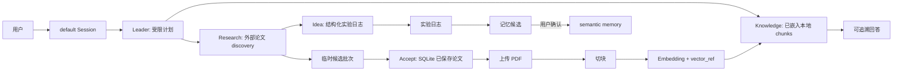

# Research Management Assistant：项目现状与闭环审查

审查日期：2026-07-11
审查性质：只读代码、测试、离线 smoke、工作树与文档核对；未修改业务代码。

## 结论摘要

项目已经从“论文检索 MVP”演化为一个**可演示、可解释、但尚未生产化的本地优先研究工作台**。最有价值的成果不是“多 agent”标签，而是把研究流拆成可验证的状态和边界：外部 discovery、内部 grounded knowledge、临时候选、已保存论文、实验日志、review-gated 长期记忆，以及持久化会话。

在显式离线配置下，V3 主路径是可闭环的；建议**先做一次收敛闭环，再决定扩展**。当前不适合直接继续堆功能，原因是运行配置、工作树基线和真实 provider 边界还没有统一。

## 本次验证证据

审查基线为本地 `main`（`6f4f86c`，位于 `.worktrees/agent-team-v3`），而不是当前根目录检出的旧前端分支。

| 检查 | 结果 | 说明 |
| --- | --- | --- |
| 后端测试，显式 deterministic/offline 环境 | 479 passed，1 warning | 通过；warning 为 Starlette `TestClient` 弃用提示 |
| 前端 Vitest | 12 files / 35 tests passed | 通过 |
| 前端 production build | 通过 | Vite build 成功 |
| `backend/scripts/smoke_offline_mvp.sh` | 通过 | 输出 `AGENT_TEAM_V3_SMOKE_OK=true` 与 `OFFLINE_MVP_SMOKE_OK=true` |
| `git diff --check HEAD..main` | 通过 | 未发现空白字符问题 |
| 后端测试，未显式固定 provider | 14 failed / 465 passed | 当前 shell/.env 导致 BGE-M3 和 LLM 配置泄漏，测试尝试联网 |

“479 passed”证明的是明确固定 provider 的离线路径；它不证明 DeepSeek、OpenAI、BGE-M3、Chroma、arXiv/OpenAlex 的真实组合已完成端到端验收。

## 当前产品地图

### 已经真正落地的能力

- **主入口**：`POST /sessions/default/turns`。会话持久化用户/助手消息、幂等键、运行状态、agent run 摘要和候选批次。
- **受限 Agent Team V3**：Leader 只从固定计划词表中选择 `direct_reply`、`clarify`、`knowledge_qa`、`research`、`idea`、`research_then_idea`；Validator 阻止自由循环、任意工具调用或动态 agent。
- **研究边界**：Research Agent 负责外部 discovery；Knowledge Agent 只回答已嵌入本地 chunks，引用不混入 discovery 结果。
- **候选生命周期**：一次研究产生 session-scoped active candidates；新 turn 会使上一批过期；用户接受后才写入长期 papers 表，再走 `accepted -> uploaded -> chunked -> embedded`。
- **记忆生命周期**：结构化实验日志是证据；规则提取的 memory candidate 必须人工 accept 才进入 confirmed semantic memory；不会按时间自动改写事实。
- **前端主路径**：default session chat、agent trace、active candidates、knowledge/discovery 区分，以及保存论文的 PDF/embedding 控制。
- **兼容层仍在**：`/research/assistant`、`/research/query`、`/papers/candidates` 等旧入口保留，部分已标为 deprecated。

## 架构判断

### 做得好的部分

1. **状态比提示词更可靠。** 论文、候选、记忆、turn 的状态均落 SQLite；这使演示和排错不依赖模型“记得”什么。
2. **证据边界清晰。** discovery 是推荐，knowledge source 只能来自 embedded chunks；这是 RAG/研究类产品最该守住的真实性边界。
3. **多 agent 被约束而非神化。** plan schema + Validator + 固定角色，避免了无限循环和“模型自行发明工具”。
4. **候选过期是正确的产品语义。** 临时推荐不会自动变成长久待办；只有 accept 才进入 paper lifecycle。
5. **默认离线路径有价值。** fake embedding/vector、deterministic idea 和离线 smoke 使功能可重复演示，并且真实 provider 被显式定位为 optional。

### 仍然是 MVP 的部分

- 仅支持一个永久的 `default` session；没有用户、项目隔离、多 session UI 或权限模型。
- PDF 没有内容与论文元数据一致性校验，未覆盖 OCR 和复杂版式恢复。
- 真实 provider 只是适配入口，不是已验证的生产链路；没有 provider health、成本统计、重试/熔断、观测或真实数据集评估。
- semantic memory 是规则提议 + 人审，尚无向量/图谱记忆检索，也没有冲突消解工作流。
- 前端仍承载 legacy fallback 面板；产品叙事已经转向 session-first，界面还需要后续收束。

## 关键缺陷与优先级

### P0：真实 provider 目标、运行配置与文档曾不一致

**证据**：`backend/src/config.py` 中 `leader_response_provider` 的 dataclass 和环境默认值均为 `deepseek`；README 和 demo 文档则称默认 deterministic/offline。未设置显式环境变量时，Leader 回复会尝试调用 DeepSeek；本次离线 smoke 也记录了网络调用失败后才 fallback。

**影响**：

- 演示/测试在不同开发机上有不同表现，可能无意发送请求或因网络卡顿；
- 全量 pytest 在当前环境出现 14 个失败，根因是 `.env`/shell 配置令 embedding/answer provider 偏离 fake/deterministic；
- “离线可复现”的项目核心卖点无法由默认命令保证。

**后续决策（2026-07-12）**：产品运行目标改为真实 provider；deterministic/fake 仅用于测试、演示兜底和故障诊断。因此不再要求产品默认离线，但必须以显式 `real`/`test` profile 取代隐式环境变量，并逐项验证 key、网络、模型、timeout、降级和可观测性。详见 V3 主线的 provider rollout register。

### P1：同步 timeout 不是可终止的 deadline

**证据**：`backend/src/agent_team/dispatcher.py` 捕获 `FutureTimeoutError` 后继续执行 `future.result()`，再 `shutdown(wait=True)`。这会等待已超时的线程实际返回。

**影响**：慢网络、模型下载或 provider 卡死时，请求仍可能超过 `AGENT_STEP_TIMEOUT_SECONDS` / `TURN_TIMEOUT_SECONDS`；数据库 turn 会长时间保持 running，随后请求得到 409。

**闭环建议**：先选择明确语义：

- 保持同步模式：所有外部 client 必须具有严格 connect/read timeout，timeout 后立即返回可恢复失败；
- 或升级为 job queue/async worker：turn 返回 queued/running，轮询或 SSE 查看最终状态。

不能把 Python thread 当成可强杀的取消机制。

### P1：开发基线和远端交付状态分裂

**证据**：根目录当前为 `codex/assistant-workflow-frontend`，落后本地 `main` 的完整 V3 代码；本地 `main` 显示相对 `origin/main` `ahead 83`。当前前端分支本身还额外有 3 个未推送的 V3 文档提交。

**影响**：从根目录运行会得到旧 UI/旧 API 行为；继续扩展极易建在错误基线上，也无法判断 GitHub 上展示的是哪一版。

**闭环建议**：先确定唯一交付分支（建议本地 `main`），完成本地工作树清理、推送/PR/合并的远端核验，再开始任何 feature branch。此审查没有联网验证远端，`ahead` 只反映本地 tracking ref。

### P2：测试隔离不足，配置是全局可变状态

**证据**：`config` 在模块导入时读取 `.env`，多处测试直接改写全局 `config` 或只覆盖部分 FastAPI dependency；API 测试可继承先前用例或环境的 provider 值。

**影响**：测试顺序和个人环境影响结果，且可能意外联网。

**闭环建议**：建立 `test` profile / `conftest.py` autouse fixture，固定 fake providers、临时数据库和缓存 reset；把 real-provider smoke 拆成显式 marker，不与普通 pytest 混跑。

### P2：产品边界仍有两套入口

**证据**：session-first 是当前主路径，但旧 `/research/assistant`、`/research/query` 和旧 candidate API 同时存在；前端保留多个 fallback/legacy 控件。

**影响**：维护者和面试官难以判断哪条是产品真入口，接口契约会持续漂移。

**闭环建议**：在 README/API 中标记迁移状态和删除条件；闭环后只保留 session-first 主叙事，把兼容 API 变成显式 legacy 区或移除。

### P3：尚未形成“真实研究质量”评价闭环

**现状**：已有 planner routing cases，但没有真实论文集上的 discovery 质量、embedding retrieval 命中、grounded answer 引用正确率、idea 可执行性或人工评审反馈指标。

**扩展建议**：先做小型离线 gold set（20–30 个 query/论文/证据对），记录 Recall@k、citation validity、fallback rate、turn latency；再决定是否值得投入真实模型与向量库。

## 是否扩展：建议的决策门

### 路线 A：先闭环（推荐）

目标不是新功能，而是把当前 V3 变成一个可稳定复现、可交付、可讲解的作品。

1. 统一 provider profile，修复默认离线与测试隔离。
2. 定义同步超时的真实行为并做失败回归测试。
3. 收敛唯一工作树/分支/远端主线，核验 GitHub main。
4. 明确 session-first API 为产品主入口，列出 legacy API 的迁移/删除计划。
5. 用 seed/reset 脚本跑一次 5–8 分钟的全流程演示，录屏或保留演示证据。
6. 用一页架构图和一份已知限制说明完成 portfolio/interview handoff。

**完成标准**：普通 `pytest` 不联网且全绿；离线 smoke 一次成功；默认启动无真实 provider 请求；根目录与 main/远端基线一致；README 能在 3 分钟内说明主流程、状态与边界。

### 路线 B：继续扩展（仅在路线 A 后）

优先级应按产品价值排序：

1. **真实检索评估与可观测性**：这是将 fake/deterministic MVP 变成可信工具的前提。
2. **项目/多 session**：如果目标是个人长期研究管理，先定义 Project -> Session -> Turn 的数据模型和迁移策略。
3. **异步任务**：PDF extraction、embedding、外部 discovery 与 LLM 调用应进入可追踪 job 模型。
4. **记忆冲突与 review UI**：保留人工确认，但补充证据链接、冲突提示、归档理由。
5. **真实 provider 一键 smoke profile**：仅在评估、超时、成本和失败降级可观测后推进。

不建议下一步做的事：继续增加 agent 数量、引入自由工具调用、把 discovery 结果伪装为 grounded source，或在未稳定基线前大改前端。

## 你应能讲清的五个设计决策

1. 为什么 discovery 和 local knowledge 必须分开？
2. 为什么候选先过期、再由用户 accept，而不是搜索即持久化？
3. 为什么 memory 先提议后确认，而不是自动写长期事实？
4. 为什么 Leader 的输出是受限 typed plan，而不是自由 agent loop？
5. 为什么 fake/deterministic provider 是工程验收工具，而非模型能力的替代品？

这些是本项目最值得作为技术面试主线的部分。
